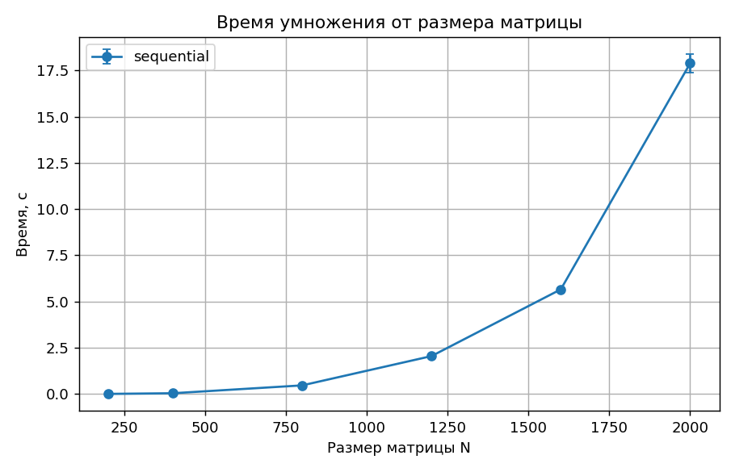
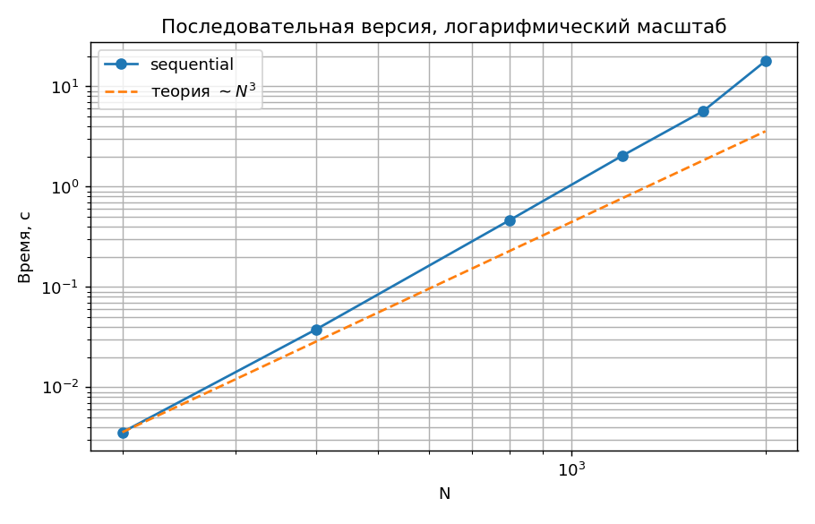
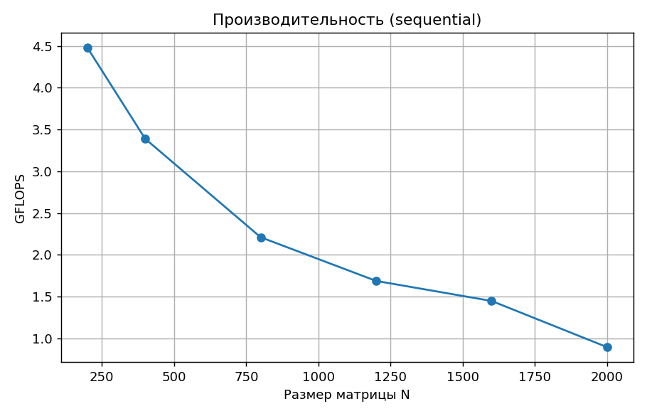

# Лабораторная работа №1

## Параллельное умножение квадратных матриц

**Курс:** Параллельное программирование, 2026 **Дедлайн:** 05.10.2026

**Студент:** Храмов Кирилл  **Группа:** 6212-100503D

---

## Задание

Написать программу на C/C++ для перемножения двух квадратных матриц.

- Исходные данные: файл(ы) со значениями исходных матриц.
- Выходные данные: файл со значениями результирующей матрицы, время выполнения, объём задачи.
- Обязательна автоматизированная верификация результатов с помощью сторонней библиотеки (NumPy).
- Исследовать зависимость времени выполнения от объёма задачи.

## Среда выполнения

- **Устройство:** 12th Gen Intel(R) Core(TM) i3-1215U (8 логических ядер)
- **Компилятор:** c++ (Ubuntu 15.2.0-16ubuntu1) 15.2.0, C++17
- **Сборка:** CMake + Make (Release, `-O3`)
- **Верификация/анализ:** Python 3, NumPy, Matplotlib

## Реализация

Реализованы две стратегии умножения матриц (`src/main.cpp`):

1. **sequential** — классический тройной цикл `for(i) for(j) for(k)`.
2. **parallel_threads** — та же логика, но строки результирующей матрицы делятся на `T` диапазонов, каждый обрабатывается в своём `std::thread`.

Время замерялось через `std::chrono::high_resolution_clock` строго вокруг вычисления, без учёта чтения/записи файлов.

Входной файл: `N`, матрица A, матрица B. Выходной файл: `N`, матрица C и метаданные (стратегия, потоки, число ядер, время).
Объём задачи: две матрицы `N x N` (`double`), `2*N^3` операций с плавающей точкой, память `3*N^2*8` байт.
GFLOPS = `2*N^3 / t_средн / 10^9`; ускорение S = `T_sequential / T_p`.

### Сборка и запуск

```bash
mkdir build && cd build
cmake ..
make
cd ..

python3 tools/generate.py 500 data/input_500.txt     # генерация входных данных
./build/matmul data/input_500.txt                    # последовательная версия
./build/matmul data/input_500.txt 4                  # 4 потока std::thread
python3 tools/verify.py data/input_500.txt data/output_500_sequential.txt

./tools/run_experiments.sh                           # вся серия экспериментов, графики, этот отчёт
```

## Эксперименты

- Размеры N: 200, 400, 800, 1200, 1600, 2000
- Потоки (0 = последовательная версия): 0
- Запусков на конфигурацию: 3; в таблице среднее, минимум и стандартное отклонение σ.

## Результаты

Исходные данные для графиков (то же в `data/results.csv`, по запускам):

| N | Память, МБ | Операций | Стратегия | Потоки | Запусков | t средн., с | t мин., с | σ, с | Ускорение | GFLOPS | Верификация | Макс. отн. погрешность |
|---|---|---|---|---|---|---|---|---|---|---|---|---|
| 200 | 0.9 | 1.600e+07 | sequential | 0 | 3 | 0.0036 | 0.0033 | 0.0003 | 1.00 | 4.481 | OK | 1.1e-06 |
| 400 | 3.7 | 1.280e+08 | sequential | 0 | 3 | 0.0378 | 0.0367 | 0.0009 | 1.00 | 3.391 | OK | 6.0e-07 |
| 800 | 14.6 | 1.024e+09 | sequential | 0 | 3 | 0.4632 | 0.4344 | 0.0253 | 1.00 | 2.211 | OK | 2.8e-07 |
| 1200 | 33.0 | 3.456e+09 | sequential | 0 | 3 | 2.0481 | 2.0248 | 0.0222 | 1.00 | 1.687 | OK | 1.8e-07 |
| 1600 | 58.6 | 8.192e+09 | sequential | 0 | 3 | 5.6600 | 5.5507 | 0.0824 | 1.00 | 1.447 | OK | 1.4e-07 |
| 2000 | 91.6 | 1.600e+10 | sequential | 0 | 3 | 17.8934 | 17.1886 | 0.5013 | 1.00 | 0.894 | OK | 1.1e-07 |







## Верификация

Результат первого запуска каждой конфигурации сравнивался с `A @ B` из NumPy. Допуск — `1e-5`
относительно `|A|@|B|` (программа выводит числа с 6 значащими цифрами, порядок суммирования различается).

## Выводы

1. **Корректность.** Результаты программы совпали с эталоном NumPy (`A @ B`) для всех запущенных конфигураций, максимальная относительная погрешность 1.1e-06.
2. **Сложность.** Алгоритм имеет сложность O(N^3). Наклон графика в логарифмическом масштабе равен 3.65 (теоретически 3). При росте N с 200 до 2000 (в 10 раз) время выросло в 5011 раз (теория: 1000).
3. **Кэш.** Время растёт быстрее N^3: при обходе матрицы B по столбцам строки не помещаются в кэш, растёт число промахов, GFLOPS падает с ростом N.
4. **Производительность.** Скорость последовательной версии - от 0.89 до 4.48 GFLOPS (максимум при N=200): одно ядро, без ручной векторизации и блочной оптимизации.
5. **База для следующих работ.** Последовательное время при N=2000 равно 17.89 с - это T1 для расчёта ускорения S = T1 / Tp и эффективности E = S / p в л/р №2-4.
